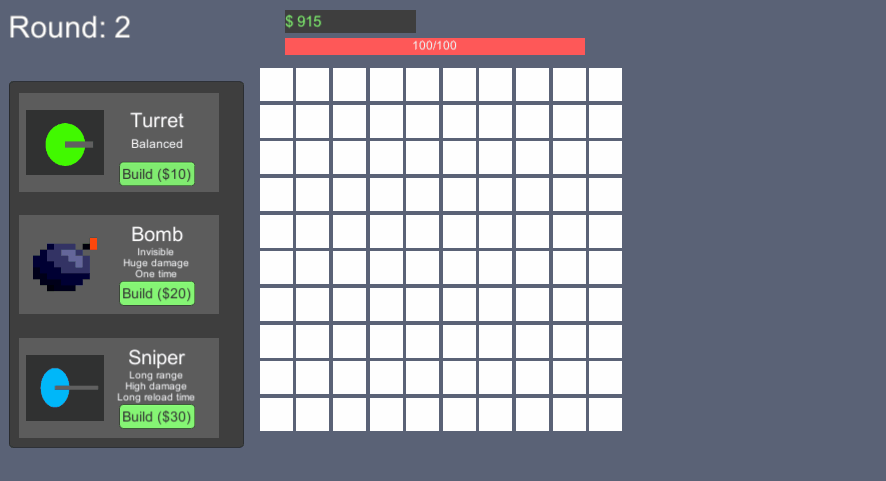

# Tower Defense Game

This is a tower defense game built in Unity and C#. The game consists of defending a base from waves of enemies by strategically placing towers along their path.

## Game mechanics
There are three types of enemies:
- **Slime**: basic enemy
- **Flyer**: not affected by bombs
- **Summoner**: spawns 4 slimes on death

The player has three types of towers to face the waves of enemies:
- **Turret**: a well balanced tower
- **Bomb**: one time, large damage and non flyer enemies don't avoid it
- **Sniper**: longe range and good damage, but takes long to reload

The enemies avoid the towers (except the bomb) and calculate the shortest path to the player base at each game tick. The player can't place towers at the respawn point and the player base, and also can't completely block the path. For balancing purposes, the board completely resets at the end of each round and a highscore is saved locally. 

## Architecture

The game architecture follows the Model-View-Controller (MVC) pattern. The **Model** contains all the logic of the game, including the enemies, towers, and their interactions. The **View** is responsible for rendering the game graphics and user interface. The **Controller** handles the player input and communicates between the Model and the View.

## Thinking Behind My Decisions

I chose the MVC pattern because it separates the concerns of the different parts of the game, making it easier to manage and maintain. This pattern also allows for easier testing and future modifications.

In terms of graphics, I decided to use a mix of free sprites and Unity Primitives. This took away the workload of building elaborated graphics and allowed me to focus on the mechanics. 

For the enemy pathfinding, I implemented the A* algorithm. This algorithm calculates the shortest path between two points while taking into account obstacles and terrain costs. I chose A* instead of simpler pathfinding algorithms (such as DFS and BFS) because it provides a better balance between efficiency and accuracy. While A* is more complex than other algorithms, it is still fast enough to handle the pathfinding requirements of our current game grid. Additionally, A* is highly scalable and can be expanded for larger grids if needed, making it a more future-proof choice for our game.

## Enemy Pathfinding with A* Algorithm

The A* algorithm is a popular pathfinding algorithm used in many games. It works by evaluating the cost of moving from one point to another, taking into account both the distance between the points and the cost of the terrain or obstacles between them.

In this tower defense game, the A* algorithm uses the following guidelines:
- Take vertical distance to the player base as the Heuristic function.
- Create a priority queue to store the open set of grid cells to explore.
- Create a dictionary to store the parent of each explored grid cell.
- Initialize the priority queue and dictionary with the start cell.
- Loop through the open set until the goal cell is found or the open set is empty:
    - Pop the cell with the lowest f-value from the priority queue.
    - If the popped cell is the goal cell, exit the loop and construct the path.
    - Generate the neighbors of the popped cell.
    - For each neighbor, calculate its g-value (the cost to reach the neighbor) and f-value (the sum of the g-value and the heuristic value to the goal cell).
    - If the neighbor has not been explored or has a lower g-value than its previous exploration, add it to the open set and update its parent and g-value in the dictionary.
- Once the path has been constructed, update the enemy's movement to follow the path instead of moving in a straight line.

